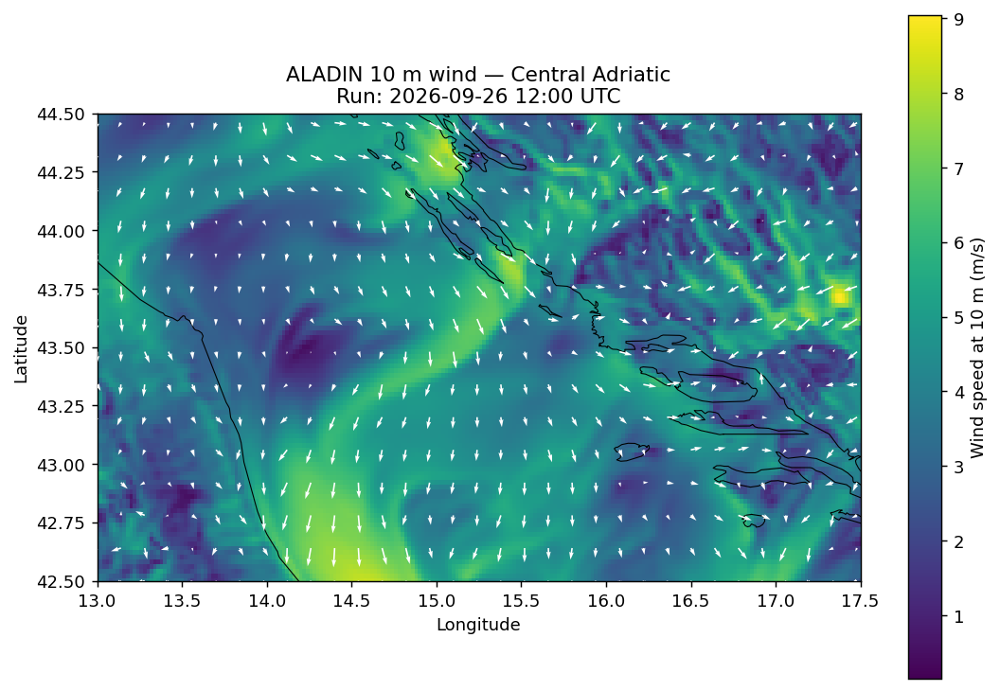

# ALADIN Adria GRIB Files

This branch (`gh-pages`) is automatically generated and contains processed GRIB files from the ALADIN weather model.

## Latest Update

**Last processed**: 2026-09-26 18:30:57 UTC




## About This Data

- **Source**: Czech Hydrometeorological Institute (CHMI) - ALADIN model
- **Model**: ALADIN Lambert 2.3km grid
- **Region**: Adriatic Sea (13.0-17.5°E, 42.5-44.5°N)
- **Resolution**: 0.02° (~2.2 km) regular lat-lon grid
- **Update frequency**: Roughly every 6 hours by CHMI, processed here within 1 hour
- **Variables included**:
  - Mean Sea Level Pressure (MSLP)
  - Wind Speed and Direction at 10m
  - Wind Gusts (u/v components)
  - Temperature at 2m

## Usage

Download files here or get the latest run directly:
```bash
wget https://k-schreiber.github.io/aladin-grib-adria/aladin_adriacenter_latest.grb
```
